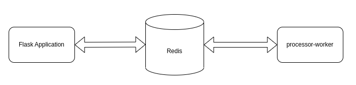
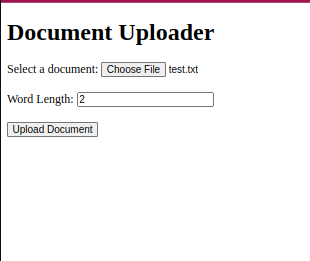
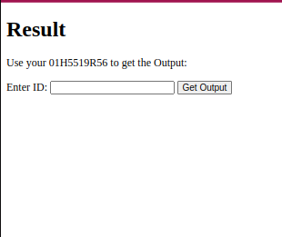
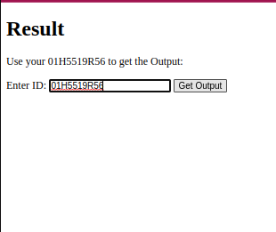
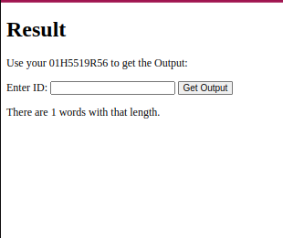

<div align = center>

| Version Info | [](https://www.python.org/downloads/release/python-3114/) [](https://releases.ubuntu.com/20.04/) |
| ------------ | ---------------------------------------------------------------------------------------------------------------------------------------------------------------------------------------------------------------------------------------------------------- |
</div>


# Document Word Count Project
This project implements a document word count system using a Redis broker and a Flask uploader application. The system allows users to upload a document and specify a word length. The uploaded document is processed by a worker, which counts the words of the specified length and stores the output in Redis. Users can then search for the word count result using the provided ID.

<p align="center">
<br>
    
</p>
<br>


## Redis Broker:

The Redis broker serves as the central component of the system. It utilizes a Redis list as the queue to handle incoming requests. The queue is designed as a circular list to ensure reliability. Once a message is successfully processed and the acknowledgment is received, the corresponding item is removed from the queue. After the processing is complete, the output, which represents the word count, is stored for retrieval.


## Uploader App:
This is an flask application with basic jinja templates, that takes care of uploading the document and the word length. It also shows the result, if searched with the id provided.


## Worker:
The worker is responsible for processing the uploaded documents. It counts the words of the specified length and pushes the results to Redis for storage. The worker retrieves the required information from the processing queue, performs the necessary word count computations, and communicates the results back to the Redis broker for storage.


## Usage:
### Configuration:
Create an `.env` file for the environment variables:  

```
 cp uploader_app/.env.example uploader_app/.env

 cp worker/.env.example worker/.env
```   


To use this, make sure you have docker installed in your system.
## Installation:

To run the application, you need to have `Docker` and `Docker Compose` installed on your system. Once you have installed [Docker](https://docs.docker.com/engine/install/) and [Docker Compose](https://docs.docker.com/compose/), you can clone this repository to your local machine using the following command:

```
git clone https://github.com/rukaiyafahmida/upload-worker.git

```  
  
##  Running the Application

Once you have created the `.env` file, you can use Docker Compose to run the app. To do this, navigate to the project directory and run the following command:

```
docker compose up --build
```

This will start the app and you can access it at `http://0.0.0.0:5000`.


## Example Usage:  

The file test.txt contains the following text:
```
Compose is a tool for defining and running multi-container Docker applications.
```   

1. Upload the file, and enter the length of the word:  
  
    
    <br>
2. After the upload, you will be given an ID:  
  
    
    <br>

3. Paste the given ID in the box:  
  
    
    <br>
4. You will have the count for the word length you provided.:  
  
    
    <br>


The video demonstration for this can be found [here](https://drive.google.com/file/d/1LTeTKIPgRH1eseNplJyaetsLHGaUJyzY/view?usp=sharing)